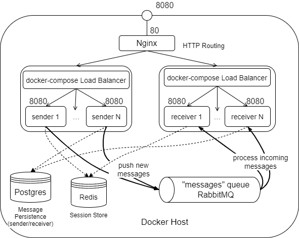
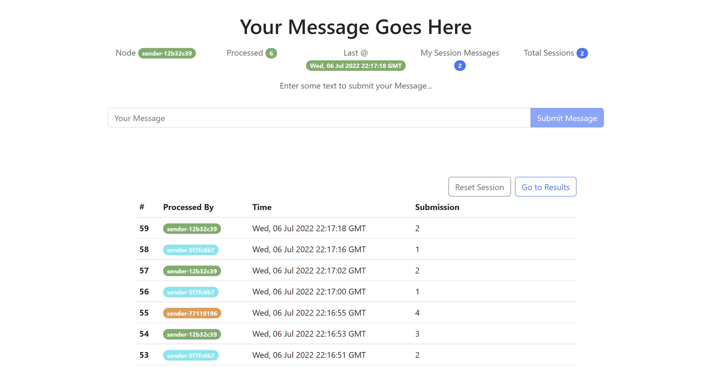

# "Microservice Async Failing" toy app

This is a silly, non-production ready toy project that i typed out as a quick test & challenge in a few hours.

Once I was done typing out the microservices & queue part I decided to add the sessions store & make it interesting
enough to upload it. Because why not.

The idea with this is that this could pretty easily scale horizontally & based on load as a real app, with minor changes.

#### Prerequisites:
Docker, Docker Compose

## Design

The architecture is as follows:




See [`./docker/docker-compose.yml`](./docker/docker-compose.yml)

- the `sender` and `receiver` services are node.js express apps. They both use a simple bootstrap page to represent their data.
- `sender` is resonsible for handling message submissions, as well as allowing users to reset their sessions
- `redis` is the session store, both `sender` and `receiver` can start sessions, but only `sender` has an endpoint to reset them. The sessions are used to track the number of messages sent, as well as display the current number of active sessions.
- `postgres` contains two separate database schemas for the `sender` and `receiver` services. In this toy app it makes no sense to have actual separate database instances, but the idea was to emulate two separate databases per microservice. The only real reason for postgresql was convenience factor based on other current projects I've been working on at this point. Realistically for this app a NoSQL database like MongoDB would be a better choice as neither ACID transactions nor SQL/JOINS are really used.
- `rabbitmq` is used to allow `sender` nodes to schedule work for `receiver` nodes (the messages). Now there's no real work to be done, but the `receiver` service is intentionally made to take up to 5 seconds to "process" messages and has a 1 in 5 chance of "failing" while handling the message, resuling in the message being reassigned to another node.


Unfortunately, this being a quick throaway project means that the services don't really have much documentation of note, nor the prettiest code. However all code of is contained within the `index.js` files of the services. Both services are quite similar.


## Running

The main idea with this app is to observe the load balancing provided by docker-compose & rabbitmq as well as the error-handling, particularly while scaling to multiple service nodes.


Running this comes down to, from within the[`./docker`](./docker) directory, running:

```shell
docker-compose build
```

followed by 
```shell
docker-compose up -d --scale sender=<number sender nodes> --scale receiver=<number receiver nodes>
```

With `<number sender nodes>` and `<number receiver nodes>` filled in appropriately


## Preview

See sample picture of app home (`sender` home) below:




### Licence: MIT License

[./LICENSE](./LICENSE)

ergo for whoever may be reading this, feel free to do with this whatever you like.
I don't really care